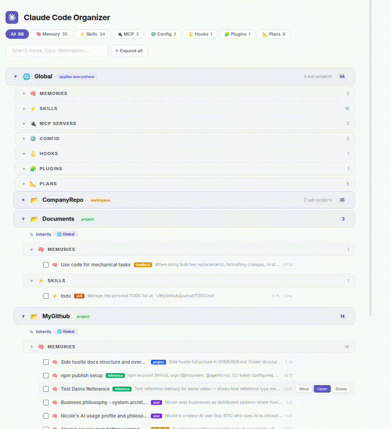

# Claude Code Organizer

[](https://www.npmjs.com/package/@mcpware/claude-code-organizer)
[](https://www.npmjs.com/package/@mcpware/claude-code-organizer)
[](https://github.com/mcpware/claude-code-organizer/stargazers)
[](https://github.com/mcpware/claude-code-organizer/network/members)
[](LICENSE)
[](https://nodejs.org)
English | [简体中文](README.zh-CN.md) | [繁體中文](README.zh-TW.md) | [廣東話](README.zh-HK.md) | [日本語](README.ja.md) | [한국어](README.ko.md) | [Español](README.es.md) | [Bahasa Indonesia](README.id.md) | [Italiano](README.it.md) | [Português](README.pt-BR.md) | [Türkçe](README.tr.md) | [Tiếng Việt](README.vi.md) | [ไทย](README.th.md)

**A visual config manager for Claude Code. See everything Claude has stored — memories, skills, MCP servers, rules, commands, agents — organized by scope. Drag items between scopes, find duplicates, clean up the mess.**

> 100+ stars in 5 days! It had just 11 stars when I first posted it on Reddit 3 days ago. Real users tested it, gave feedback, and helped shape it into what it is now. This is my first open source project — thank you to everyone who starred, tested, and reported issues. This is just the beginning.



<sub>Demo video recorded by AI automatically using [Pagecast](https://github.com/mcpware/pagecast)</sub>

## The Problem

Two things happen silently every time you use Claude Code — and neither one is visible to you.

### Problem 1: Where you put things matters — and Claude puts them in the wrong place

Claude Code has a scope hierarchy: **Global → Workspace → Project**. Anything in Global loads into every session on your machine. Anything in a Project scope only loads when you're in that directory. Where a memory, skill, or MCP server sits determines which sessions it affects.

The problem: **Claude doesn't care about scope when it creates things.** It dumps everything into whatever scope matches your current directory. Over time, this turns into a mess:

**Skills in the wrong scope affect the wrong projects:**
- You build a deploy skill while working in your backend repo. It lands in that project's scope. But you want it everywhere — it should be in Global. Without moving it, your other projects can't see it. You end up creating another one in other projects.
- A Python-specific testing skill sitting in Global gets loaded into every React frontend session. It wastes tokens and confuses Claude with irrelevant instructions.

**Memories pile up and duplicate:**
- You tell Claude "always use ESM imports" while inside a project. That memory is trapped in that project scope — your other projects don't get it.
- My experience: Claude created 3 separate memories about Slack updates, all saying the same thing. Each one loads every session.

**MCP servers silently reinstall across scopes:**


Teams installed twice, Gmail three times, Playwright three times. You configured them in one scope, Claude reinstalled them in another. Each duplicate loads independently.

**You can manage this with CLI commands or by asking Claude** — `ls` one directory, `cat` each file, ask Claude to move this here, delete that, show me what's in this scope. But you're spending turns and tokens just to understand the layout, one item at a time, before you can even decide what to do with it. There's no single view that shows you the full picture: all items, all scopes, all inheritance, at once.

### Problem 2: You have no idea how much context is already used

All of this wrong-scope and duplicate config has a cost. This is a real project directory after two weeks of use:


**~29K tokens immediately loaded into context, with another ~112K deferred for MCP tools.** On a 200K window, that's ~14% gone before you type — and grows as Claude selectively loads tools during the session. The fuller the context, the less accurate Claude becomes (**context rot**).

And these numbers only cover what we can measure offline. During a session, Claude silently adds more: rule files re-injected after every tool call, file change diffs, and your full conversation history resent on every API call.

### The fix: a visual config manager

```bash
npx @mcpware/claude-code-organizer
```

Think of it like a file manager for `~/.claude/`. You can do everything in terminal too — but sometimes you need to see the whole tree to understand what's going on.

The workflow: see what's loaded and where it comes from → spot duplicates and wrong-scope items → drag-and-drop to the right scope or delete → check Context Budget → refresh → repeat until your initial load is lean.

> **First run auto-installs a `/cco` skill** — after that, just type `/cco` in any Claude Code session to open the dashboard.

### Example: Move a skill to the right scope

You built a `deploy` skill while working in `~/myapp`. It ended up in that project's scope — only visible when you're in `~/myapp`. But it should be Global so all your projects can use it. Open the dashboard, find the skill, drag it from Project to Global. **Done. One drag.** Now every project on your machine can use it.

### Example: See what a project actually inherits

You open a deeply nested project and Claude is behaving weirdly — following instructions you don't remember setting. Click the project in the dashboard. You see its own items, plus everything inherited from parent scopes: workspace-level memories, global skills, MCP servers from two levels up. Now you know exactly what's influencing Claude in this directory.

### Example: Find and clean up duplicates

Claude created the same memory in 3 scopes. An MCP server got installed in both Global and your project. Switch to **By Category** view — all items of the same type across all scopes grouped together. Duplicates jump out immediately. Preview each one, decide which to keep, delete the rest.

---

## Comparison

How does this compare to other Claude Code tools?

| Feature | **Claude Code Organizer** | Desktop app (600+⭐) | VS Code extension | Analytics dashboards | TUI tools |
|---------|:---:|:---:|:---:|:---:|:---:|
| True scope hierarchy (Global > Workspace > Project) | **Yes** | No | Partial (no workspace) | No | No |
| Drag-and-drop moves | **Yes** | No | No | No | No |
| Cross-scope moves | **Yes** | No | One-click | No | No |
| Undo on every action | **Yes** | No | No | No | No |
| Bulk operations | **Yes** | No | No | No | No |
| Real MCP server management | **Yes** | Global only | Stub (icon only) | No | No |
| Context budget (token breakdown) | **Yes** | No | No | No | No |
| Commands + Agents + Rules | **Yes** | No | No | No | No |
| Session management | **Yes** | No | No | Yes | Yes |
| Search & filter | **Yes** | No | Yes | Yes | No |
| MCP tools (AI-accessible) | **Yes** | No | No | No | No |
| Zero dependencies | **Yes** | No (Tauri+React) | No (VS Code) | No (Next.js/FastAPI) | No (Python) |
| Standalone (no IDE) | **Yes** | Yes | No | Yes | Yes |

## Features

- **Scope-aware hierarchy** — See all items organized as Global > Workspace > Project, with inheritance indicators
- **Drag-and-drop** — Move memories, skills, commands, agents, rules, MCP servers, and plans between scopes
- **Undo everything** — Every move and delete has an undo button — restore instantly, including MCP JSON entries
- **Bulk operations** — Select mode: tick multiple items, move or delete all at once
- **Same-type safety** — Each category moves to its own directory — memories to memory/, skills to skills/, commands to commands/, etc.
- **Search & filter** — Real-time search across all items, filter by category with smart pill hiding (zero-count pills collapse into "+N more")
- **Context Budget** — See what's always loaded vs deferred, per-item token counts (ai-tokenizer ~99.8% accuracy), inherited scope breakdown, @import expansion, and 200K/1M context window toggle
- **Detail panel** — Click any item to see full metadata, content preview, file path, and open in VS Code
- **Session inspector** — Parsed conversation previews with speaker labels, session titles, and metadata
- **11 categories** — Memories, skills, MCP servers, commands, agents, rules, configs, hooks, plugins, plans, and sessions
- **Bundled skill detection** — Groups skills by source bundle via `skills-lock.json`
- **Contextual Claude Code prompts** — "Explain This", "Edit Content", "Edit Command", "Edit Agent", "Resume Session" buttons that copy to clipboard
- **Auto-hide detail panel** — Panel stays hidden until you click an item, maximizing content area
- **Resizable panels** — Drag dividers to resize sidebar, content area, and detail panel
- **Real file moves** — Actually moves files in `~/.claude/`, not just a viewer
- **Path traversal protection** — All file endpoints validate paths are within HOME directory
- **Cross-device support** — Automatic copy+delete fallback when rename fails across filesystems (Docker/WSL)
- **Tested** — E2E test suite covering scanner accuracy, context budget calculations, filesystem verification, security, and all 11 categories


## Quick Start

### Option 1: npx (no install needed)

```bash
npx @mcpware/claude-code-organizer
```

### Option 2: Global install

```bash
npm install -g @mcpware/claude-code-organizer
claude-code-organizer
```

### Option 3: Ask Claude

Paste this into Claude Code:

> Run `npx @mcpware/claude-code-organizer` — it's a dashboard for managing all Claude Code resources. Tell me the URL when it's ready.

Opens a dashboard at `http://localhost:3847` that works directly with your real `~/.claude/` directory. Next time, just type `/cco` in Claude Code to reopen.

## What It Manages

| Type | View | Move | Delete | Scanned at |
|------|:----:|:----:|:------:|:----------:|
| Memories (feedback, user, project, reference) | Yes | Yes | Yes | Global + Project |
| Skills (with bundle detection) | Yes | Yes | Yes | Global + Project |
| MCP Servers | Yes | Yes | Yes | Global + Project |
| Commands (slash commands) | Yes | Yes | Yes | Global + Project |
| Agents (subagents) | Yes | Yes | Yes | Global + Project |
| Rules (project constraints) | Yes | Yes | Yes | Global + Project |
| Plans | Yes | Yes | Yes | Global + Project |
| Sessions | Yes | — | Yes | Project only |
| Config (CLAUDE.md, settings.json) | Yes | Locked | — | Global + Project |
| Hooks | Yes | Locked | — | Global + Project |
| Plugins | Yes | Locked | — | Global only |

## Scope Hierarchy

```
Global                       <- applies everywhere
  Company (workspace)        <- applies to all sub-projects
    CompanyRepo1             <- project-specific
    CompanyRepo2             <- project-specific
  SideProjects (project)     <- independent project
  Documents (project)        <- independent project
```

Child scopes inherit parent scope's memories, skills, MCP servers, commands, agents, and rules.

## How It Works

1. **Scans** `~/.claude/` — discovers all projects, memories, skills, MCP servers, commands, agents, rules, hooks, plugins, plans, and sessions
2. **Resolves scope hierarchy** — determines parent-child relationships from filesystem paths
3. **Renders dashboard** — three-panel layout: sidebar scope tree, category-grouped items, detail panel with content preview
4. **Handles moves** — drag or click "Move to...", moves files on disk with safety checks, undo support
5. **Handles deletes** — delete with undo, bulk delete, session cleanup

## Platform Support

| Platform | Status |
|----------|:------:|
| Ubuntu / Linux | Supported |
| macOS (Intel + Apple Silicon) | Supported (community-tested on Sequoia M3) |
| Windows 11 | Supported (community-tested, VS Code extension) |
| WSL | Supported |

## Project Structure

```
src/
  scanner.mjs       # Scans ~/.claude/ — 11 categories, pure data, no side effects
  mover.mjs         # Moves/deletes files between scopes — safety checks + undo support
  server.mjs        # HTTP server — REST API + context budget engine
  tokenizer.mjs     # Token counting (ai-tokenizer ~99.8% accuracy, bytes/4 fallback)
  mcp-server.mjs    # MCP server — 4 tools for AI clients (scan, move, delete, destinations)
  ui/
    index.html       # Three-panel layout with resizable dividers
    style.css        # All styling (edit freely, won't break logic)
    app.js           # Frontend: drag-drop, search, filters, bulk ops, undo, session preview
bin/
  cli.mjs            # Entry point (--mcp flag for MCP server mode)
```

Frontend and backend are fully separated. Edit `src/ui/` files to change the look without touching any logic.

## API

The dashboard is backed by a REST API:

| Endpoint | Method | Description |
|----------|--------|-------------|
| `/api/scan` | GET | Scan all customizations, returns scopes + items + counts |
| `/api/move` | POST | Move an item to a different scope (supports category/name disambiguation) |
| `/api/delete` | POST | Delete an item (memory, skill, MCP, command, agent, rule, plan, session) |
| `/api/restore` | POST | Restore a deleted file (undo support) |
| `/api/restore-mcp` | POST | Restore a deleted MCP server JSON entry (undo support) |
| `/api/destinations` | GET | Get valid move destinations for an item |
| `/api/file-content` | GET | Read file content for detail panel preview |
| `/api/session-preview` | GET | Parse JSONL session into readable conversation with speaker labels |
| `/api/context-budget` | GET | Token budget breakdown — always loaded vs deferred, per scope |
| `/api/export` | POST | Export all configs to a folder, organized by scope |

## Roadmap

| Feature | Status | Description |
|---------|:------:|-------------|
| **Config Export/Backup** | ✅ Done | One-click export all configs to `~/.claude/exports/`, organized by scope |
| **Skill Quality Scoring** | 📋 Planned | Rate and surface the best skills from 5,000+ in the ecosystem — no more guessing |
| **Security Audit** | 📋 Planned | Scan your `.claude/` for risky permissions, leaked secrets, or suspicious hooks |
| **Cross-Harness Portability** | 📋 Planned | Convert skills/configs between Claude Code ↔ Cursor ↔ Codex ↔ Gemini CLI |
| **Cost Tracker** | 💡 Exploring | Track token usage and cost per session, per project |
| **Diff View** | 💡 Exploring | Compare configs between scopes or between snapshots |

Have a feature idea? [Open an issue](https://github.com/mcpware/claude-code-organizer/issues).

## License

MIT

## More from @mcpware

| Project | What it does | Install |
|---------|---|---|
| **[Instagram MCP](https://github.com/mcpware/instagram-mcp)** | 23 Instagram Graph API tools — posts, comments, DMs, stories, analytics | `npx @mcpware/instagram-mcp` |
| **[UI Annotator](https://github.com/mcpware/ui-annotator-mcp)** | Hover labels on any web page — AI references elements by name | `npx @mcpware/ui-annotator` |
| **[Pagecast](https://github.com/mcpware/pagecast)** | Record browser sessions as GIF or video via MCP | `npx @mcpware/pagecast` |
| **[LogoLoom](https://github.com/mcpware/logoloom)** | AI logo design → SVG → full brand kit export | `npx @mcpware/logoloom` |
## Author

[ithiria894](https://github.com/ithiria894) — Building tools for the Claude Code ecosystem.

[](https://glama.ai/mcp/servers/mcpware/claude-code-organizer)
